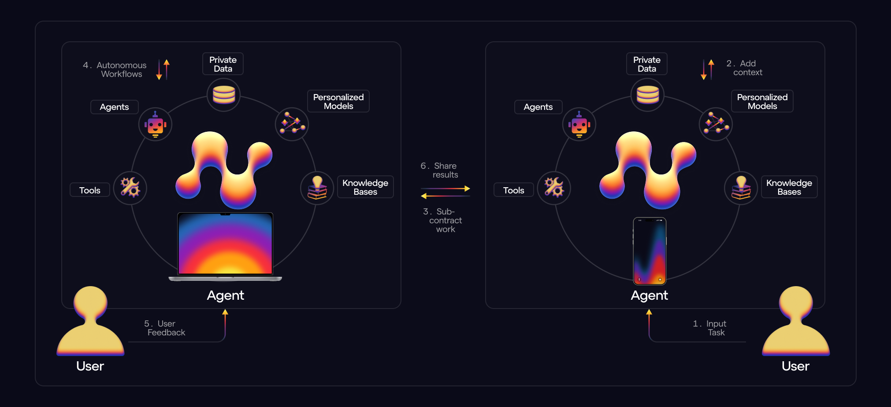

# Welcome to Naptha

Naptha is a framework and infrastructure for developing and running multi-agent systems at scale with heterogeneous models, architectures and data. Agents and other modules can run on separate devices, while still interacting over the network. Our mission is to reimagine the internet - to bring forth the Web of Agents - by enabling the next-generation of AI applications and use cases.

  <a href="https://docs.naptha.ai/">Documentation</a> |
  <a href="https://naptha.ai/">Website</a> |

## Getting Started

- 📚 Read the [Documentation](https://docs.naptha.ai/) for guides and tutorials
- ✨ Check out the Naptha [SDK](https://github.com/NapthaAI/naptha-sdk) to start building agents and multi-agent systems
- 🔍 Fork the [Naptha Module Template](https://github.com/NapthaAI/module_template) to start building your own modules
- 💻 Run a Naptha [Node](https://github.com/NapthaAI/naptha-node) to run agents locally (which can communicate with agents running on other nodes)

## Become a contributor to the Naptha Node

- 📚 Check out our guides for contributing to Naptha:
  - [Naptha SDK](https://docs.naptha.ai/Contributing/module-builder)
  - [Naptha Node](https://docs.naptha.ai/Contributing/infrastructure-contributor)
- 👥 Apply to join our [Discord community](https://naptha.ai/naptha-community) 
- 💰 Apply for Bounties and Microgrants at team@naptha.ai